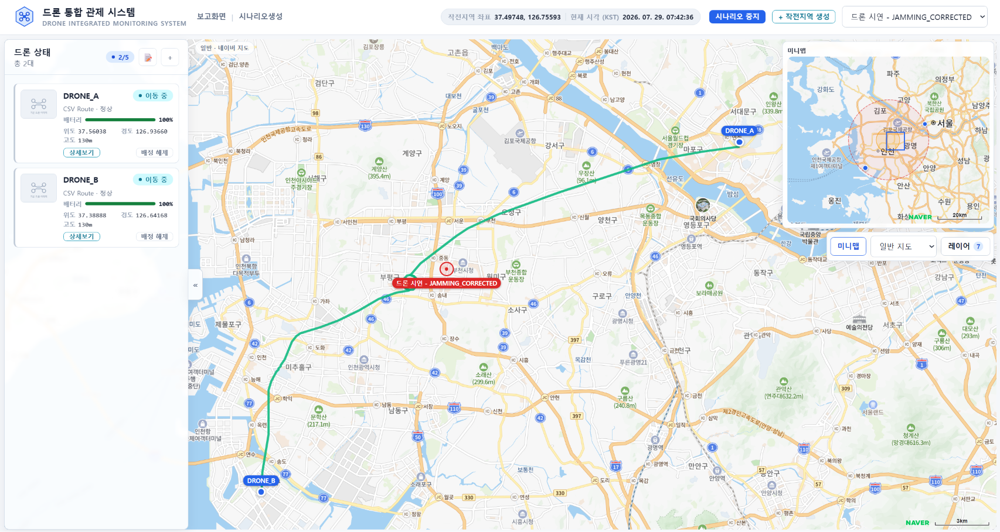

# AI를 활용한 드론 이미지 기반 복합 위치 추정 시스템

> KDT 2026 Acorn 7기 2팀 Final Project  
> GNSS Denied Navigation · Drone Surveillance Control System

드론 감시·정찰 데이터를 실시간으로 확인하고, 재밍·스푸핑 상황을 시뮬레이션하는 관제 서비스입니다.


<br>
<p align="center">
  
</p>

<p align="center">
  <a href="./docs/final-presentation.pdf">
    PDF 자료 보기
  </a>
  &nbsp;&nbsp;|&nbsp;&nbsp;
  <a href="http://140.245.92.139:8000/docs">
    FastAPI 문서
  </a>
</p>

---

## 프로젝트 소개

GNSS 재밍·스푸핑 환경에서 드론의 위치정보가 불안정해지는 상황을 시뮬레이션하고,  
드론 영상과 위성 이미지의 Cross-view Geo-localization 결과를 관제 화면에서 확인할 수 있도록 구현한 프로젝트입니다.

## 시스템 구성

### 운영 환경

```text
Web Browser
    ↓
Frontend
    ↓ REST API / WebSocket
Nginx
    ↓
FastAPI Backend
    ├─ PostgreSQL / PostGIS
    ├─ MinIO
    ├─ FAISS
    └─ AI Model
```

### 로컬 환경

```text
웹 브라우저
    ↓
frontend (React, Vite / 5173)
    ↓
backend_local (FastAPI / 8000)
    ├─ SQLite: backend_local/local-data/
    └─ 파일 저장소: backend_local/local-storage/
```

`backend_local`은 PostgreSQL이나 MinIO 없이 SQLite와 로컬 파일 저장소만 사용합니다.

---

# 로컬에서 실행하기

서버에 접속할 수 없거나 코드를 직접 실행하려면 `frontend`와 `backend_local`을 사용합니다.

## 1. 프로젝트 내려받기

```bat
git clone https://github.com/yangjunho-m/KDT_final_project_2team_Demo.git
cd KDT_final_project_2team_Demo
```
---

## 2. 환경설정

`.env.example` 파일을 참고하여 환경변수를 설정합니다.

추론에 사용할 이미지는 다음 폴더에 넣습니다.

```text
backend_local/local-storage/
```

---

## 3. 로컬 백엔드 준비

첫 실행 때 한 번만 진행합니다.

```bat
cd backend_local
python -m venv .venv
.venv\Scripts\activate
pip install -r requirements.txt
```

준비가 끝나면 백엔드를 실행합니다.

```bat
run_local.cmd
```
---

## 4. 프론트엔드 실행

백엔드 터미널은 그대로 두고 새로운 터미널을 하나 더 엽니다.

```bat
cd KDT_final_project_2team_Demo\frontend
run_local.cmd
```

최초 실행에서는 프론트엔드 패키지를 자동으로 설치하므로 시간이 조금 걸릴 수 있습니다.

터미널에 표시되는 다음 주소를 웹 브라우저에서 엽니다.

```text
http://localhost:5173
```

---

## 5. 실행 확인

다음 주소가 정상적으로 열리면 로컬 실행이 완료된 것입니다.

- 프론트엔드  
  http://localhost:5173

- 백엔드 API 문서  
  http://127.0.0.1:8000/docs

---

## 프로젝트 구조

```text
KDT_final_project_2team_Demo/
├─ frontend/              # React 기반 관제 화면
├─ backend_local/         # 로컬 실행용 FastAPI 백엔드
│  ├─ local-data/         # SQLite 데이터
│  └─ local-storage/      # 이미지 파일 저장소
├─ docs/                  # 발표 자료 및 README 이미지
├─ .env.example           # 환경변수 예시
└─ README.md
```

---

